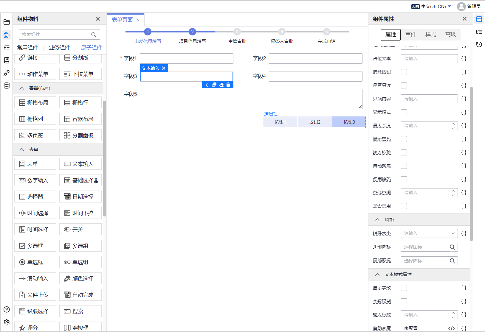

# clever-app-studio

本项目致力于探索和实现 `vue3` 技术栈在前端低代码开发领域的最优技术方案。

在线预览: [http://all.msvc.top:31003/#/workbench/welcome](http://all.msvc.top:31003/#/workbench/welcome)

近年来，得益于JavaScript引擎的进步、新语法的引入、前端框架的创新以及工具链的完善，前端低代码开发再次成为行业的热点。
市场上已经涌现出许多优秀的商业和开源产品，其中一些表现尤为出色，例如：
- [阿里LowCodeEngine](https://lowcode-engine.cn/index)：使用react技术栈
- [NocoBase](https://github.com/nocobase/nocobase)：使用react技术栈
- [designable](https://github.com/alibaba/designable)：使用react技术栈
- [华为TinyEngine](https://github.com/opentiny/tiny-engine)：使用vue技术栈

尽管这些项目表现出色，但并非适合所有用户。对于小型团队或全栈工程师而言，它们存在以下局限性：
1. 多数项目基于React技术栈。随着React的逐渐失宠和Vue3在国内的流行，这些项目在许多公司中并不适用。
2. 自定义改造极其困难，成本高昂，对于缺乏前端资源的项目来说难以实施。
3. 封闭性较强，不提供底层API。它们大多以产品形式提供功能，难以根据特定项目需求进行定制。
4. 低代码开发完成后，无法立即发布功能。例如，无法直接集成系统菜单和权限功能，使得开发完成后的功能无法让用户立即投入使用。
5. 缺乏与后端服务或框架的直接关联。在许多小团队中，一个人可能同时负责前端和后端开发。即使采用了低代码系统，仍然需要前后端两个团队协同开发，人力成本依然较高。

为了应对前端低代码领域的技术挑战，我利用业余时间启动了这个项目。目前，我们已经取得了一些令人振奋的成果：
1. 流畅的拖拽体验：完全自主开发了设计器组件的拖拽逻辑，不仅操作流畅，还支持多选和批量设置组件属性，大幅提升了用户体验。
2. 灵活的自定义组件：支持用户注册自定义组件和设置器，确保了低代码平台的灵活性。几乎任何可以用Vue实现的页面，我们的平台都能轻松构建。
3. 灵活的页面产物：设计的低代码页面既可以导出为纯JSON数据，也可以转换为不依赖任何外部库的JavaScript代码(JS对象)。这意味着，您可以轻松地将这些页面保存在数据库中，并在需要时动态加载和渲染成功能完备的页面。

鉴于个人时间有限，未来如果工作需求增加，我计划启动一个新项目，基于当前的技术成果，开发一套完整的从前端到后端的低代码解决方案。

如果您对我的项目感兴趣，并且有类似的愿景，欢迎随时与我联系。您可以通过以下方式找到我：
- 邮箱：`1183409807@qq.com`
- 微信

